# Write Agent

[](./LICENSE)

A full-stack AI writing agent for style extraction, rewriting, review, cover generation, and publishing-ready WeChat layout (FastAPI + React/Vite).

[中文文档](./docs/README.zh-CN.md)

## Highlights and Business Value

- Productize fragmented writing actions into one standardized loop: material retrieval, style-constrained rewriting, quality review, human refinement, cover generation, and layout publishing.
- In our practical usage, value shows up in two dimensions: productivity (long-form output can move from hour-level effort to roughly tens-of-minutes), and quality (more stable style, reviewable outputs, and replayable process instead of one-shot prompt luck).
- During writing, the app can run RAG retrieval against your materials library and show cited materials in the output context for traceability.
- Rewrite now supports a controlled editor-review loop: `draft(1) -> review(1) -> (if failed) draft(2) -> review(2)`, with backend-capped retries (`max_retries=1`) to avoid infinite loops.
- WeChat layout capability: format content in multiple styles based on official account publishing conventions, then export to WeChat with one click.

## Core Workflow and Screenshots

### End-to-End Workflow Diagram



1. **Rewrite**: input source text, pick style, set target length (`100-8000` preset options, default `500`), stream output. Home also shows real-time loop stage hints (first draft, first review, second draft, second review, final state). The top nav supports site-wide `CN / EN` switching (saved in `localStorage` as `write_agent_lang`).


2. **Style Management**: create and reuse writing style DNA.


3. **Materials (RAG)**: collect materials, test retrieval, and reuse in writing.


4. **Review**: inspect rewrite results and do manual edits when needed.


5. **Cover Generation**: generate covers from rewrite results with multiple modes and ratios.


6. **Layout**: jump from Rewrite/Review/Covers to `/layout` with `rewrite_id`, auto-import content and cover (if available), then apply theme, preview in real time, and copy to WeChat.


7. **GitHub Trends**: captures weekly Top10 repositories by star growth over the last 7 days, with week selection and manual refresh. Each repo can be sent to Materials or Rewrite in one click, connecting topic discovery to the writing workflow.


8. **Linux.do Trends**: aggregates public Linux.do hot topics by `7 days / 30 days`, supports period history switch (recent 12 periods), single-tag server-side filtering, and manual refresh with cooldown / rate-limit backoff protection. Each item can be sent to Materials or Rewrite in one click.


## Quick Start

### 1. Clone and install

```bash
git clone https://github.com/guoguo-tju/write_agent.git
cd write_agent
uv sync
cd frontend && npm install && cd ..
```

### 2. Configure API keys

```bash
cp .env.example .env
```

Edit `.env` with:

- Required: `OPENAI_API_KEY`, `VOLCENGINE_API_KEY`
- Optional: `SILICONFLOW_API_KEY` (for writing-time RAG embedding/retrieval and citation display)
- Optional: `GITHUB_TOKEN` (or `GITHUB_PERSONAL_ACCESS_TOKEN`) for richer GitHub trends enrichment context.

### 3. Start backend

```bash
PYTHONPATH=src DATABASE_URL=sqlite:///./data/acceptance_write_agent.db .venv/bin/uvicorn write_agent.main:app --host 127.0.0.1 --port 8000
```

### 4. Start frontend

```bash
cd frontend
npm run dev
```

### 5. Open locally

- Frontend: `http://127.0.0.1:5173`
- Backend docs: `http://127.0.0.1:8000/docs`
- Suggested first run path: `Rewrite -> Review -> Covers -> Layout (/layout)`.

Note: without `SILICONFLOW_API_KEY`, the main flow still runs, but writing-time RAG retrieval/citation is limited.

## Project Structure

```text
.
├── src/write_agent/        # backend (api, models, services)
├── frontend/               # React + Vite frontend
├── scripts/                # db/init/smoke scripts
├── tests/                  # backend tests
├── data/                   # sqlite + chroma data
└── docs/screenshots/       # README screenshots
```

## Development Spec

- Entry for AI contributors: [`AGENTS.md`](./AGENTS.md)
- Full engineering spec: [`docs/specs/development-spec-v1.md`](./docs/specs/development-spec-v1.md)
- Verification checklist: [`docs/specs/verification-checklist.md`](./docs/specs/verification-checklist.md)

## FAQ

### 1) Backend starts but rewrite/style/review fails

Check `OPENAI_API_KEY` and related OpenAI-compatible config in `.env`.

### 2) Cover generation fails

Check `VOLCENGINE_API_KEY`, `VOLCENGINE_BASE_URL`, and model config.

### 3) Materials retrieval is empty

Check `SILICONFLOW_API_KEY` and network access to embedding service.

### 4) Frontend cannot call backend (CORS or network)

Use `http://127.0.0.1:5173` for frontend and `http://127.0.0.1:8000` for backend, and keep `VITE_API_URL` aligned.

### 5) Why are cover images not in GitHub?

Cover images are runtime assets stored locally under `./data/covers`, and this directory is intentionally ignored by Git.

### 6) Why does GitHub Trends show a missing token / degraded reminder?

It means the system automatically fell back to the baseline fetch flow and did not block core actions. Configure `GITHUB_TOKEN` (or `GITHUB_PERSONAL_ACCESS_TOKEN`) to get richer enrichment context.

## License

[MIT License](./LICENSE)
