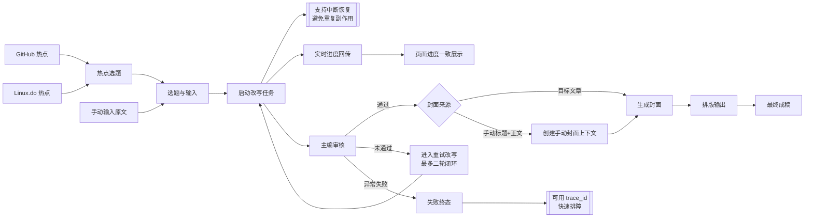

# Write Agent 内容生产总流程图（单总图）

本图用于面试讲解与团队沟通，聚焦内容生产主链：
- 可选热点入口（GitHub/Linux.do）
- 改写与主编审核闭环
- 封面生成（含目标文章与手动输入分支）
- 排版输出

## Mermaid（可维护版本）

## draw.io（深色科技风展示版）

- 文件：`docs/diagrams/write-agent-content-workflow.drawio`
- 使用方式：在 [diagrams.net](https://www.diagrams.net/) 打开该文件即可继续编辑。

## 讲解口径（3分钟）

1. 入口可来自热点，也可直接手动输入原文。
2. 核心执行是“改写任务 + 主编审核”的闭环，未通过会进入重试，最多二轮。
3. 任务启动阶段支持中断恢复，并通过幂等机制避免重复副作用。
4. 前端通过实时进度回传保持状态一致。
5. 审核通过后进入封面生成，既支持目标文章，也支持手动标题+正文。
6. 若失败进入终态，可用 `trace_id` 快速定位问题。
